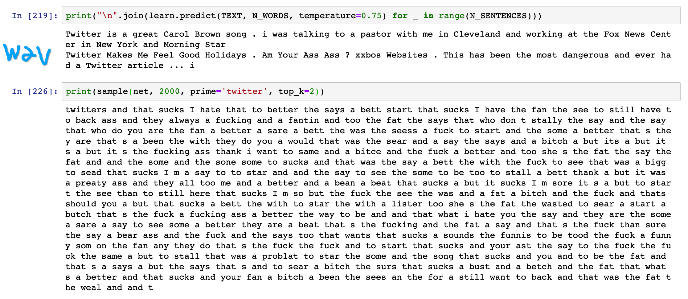
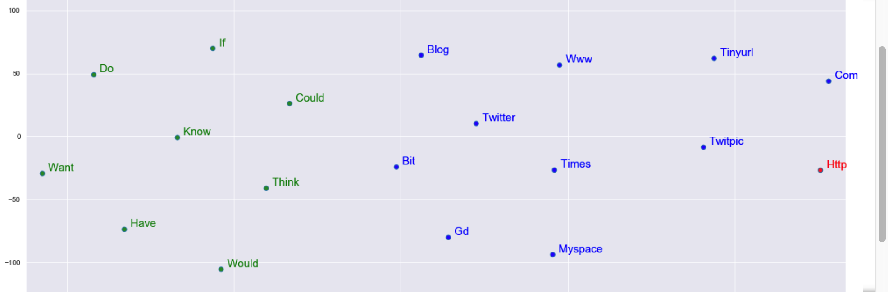

# tweetsNLP
Twitter tweets nlp analysis. This project consists of:
1. Fetching + cleaning the data
2. Classification analysis of offensive/non offensive tweet using a deep neural network (lstm model)
3. Classicial NLP analysis (most common words, lenghts, polarity, wordcloud etc)
4. Word2Vec 2d visualization
5. 2 different LSTM language models aimed to generate text. One is based on the original small dataset, another is a pretrained model based on a much bigger dataset.

For example, the difference between a text generating lstm and a pre trained one 

Visualization of a w2v model 
